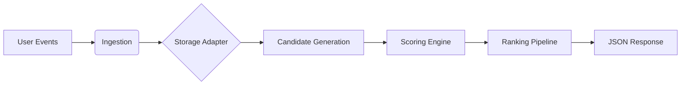

# RecFlow 🌊

[](https://pypi.org/project/recflow/)
[](https://opensource.org/licenses/MIT)

A **production-grade, stateful backend recommendation engine** library tailored for high-scale, event-driven environments. 

RecFlow is not a Machine Learning framework. It is an **autonomous execution engine** designed to live natively within your backend services. It tracks interactions in real-time, maintains high-performance state, and applies deterministic relevance heuristics to serve rankings in sub-10ms.

---

## 📑 Table of Contents
- [🚀 Quick Start](#-quick-start)
- [🏗️ Modular Architecture](#%EF%B8%8F-modular-architecture)
  - [Storage Adapters](#storage-adapters)
  - [Candidate Generation](#candidate-generation)
  - [Relevance Scoring](#relevance-scoring)
- [🔌 Framework Integrations](#-framework-integrations)
  - [FastAPI](#fastapi-async-performance)
  - [Django](#django-enterprise-middleware)
  - [Flask](#flask-daemon-thread-tracking)
- [⚙️ Advanced Rules & Metrics](#%EF%B8%8F-advanced-rules--metrics)
- [🛠️ Monitoring & Admin](#%EF%B8%8F-monitoring--admin)
- [📉 Why RecFlow?](#-why-recflow)

---

## 🚀 Quick Start

### Installation
```bash
# Core framework
pip install recflow

# With full enterprise support
pip install recflow[redis,fastapi,django,flask]
```

### 5-Minute Minimal Implementation
```python
from recflow import Engine

# Initialize engine with local persistent storage
engine = Engine(storage_uri="recflow.db")

# 1. Track interactions
engine.track_interaction(user="user_123", item="prod_abc", event_type="view")

# 2. Add metadata for scoring rules
engine.update_item("prod_abc", {"category": "electronics", "is_sponsored": True})

# 3. Configure a simple boost rule
engine.rules.add_metadata_boost("is_sponsored", True, multiplier=2.5)

# 4. Get instant recommendations
recommendations = engine.get_recommendations(user="user_123", limit=5)
```

---

## 🏗️ Modular Architecture

RecFlow is built on a "Pipeline" philosophy where every stage is pluggable.



### Storage Adapters
RecFlow supports three primary storage modes depending on your scale:
- **`InMemoryStorage`**: Best for testing and ephemeral caching.
- **`SQLiteStorage`**: Persistent, zero-config storage for smaller apps or single-node deployments.
- **`RedisStorage`**: Distributed, high-concurrency storage. Synchronizes state across an entire server cluster.

### Candidate Generation
The "Generator" system gathers potential items from various pools before scoring. You can add custom generators by extending `CandidateGenerator`:

```python
from recflow.candidates import CandidateGenerator

class MyCustomGenerator(CandidateGenerator):
    def generate(self, user_id, storage, limit=100):
        # Fetch items from a 3rd party API, Social Graph, etc.
        return ["item_1", "item_42"]

engine.ranker.candidates_mgr.generators.append(MyCustomGenerator())
```

### Relevance Scoring
RecFlow uses deterministic decay and multiplier logic rather than black-box models.
- **Recency Decay**: Automatically penalizes old interactions via a configurable half-life.
- **Frequency Penalties**: Anti-spam logic that prevents users from seeing the same item too many times.
- **Metadata Logic**: Dynamic boosts/filters based on current item properties.

---

## 🔌 Framework Integrations

### FastAPI (Async Performance)
Uses `AsyncEngine` to offload blocking IO to a thread pool, ensuring 100% async compatibility.

```python
from fastapi import FastAPI, Depends
from recflow import AsyncEngine
from recflow.ext.fastapi import RecFlowMiddleware, get_engine

app = FastAPI()
engine = AsyncEngine(storage_uri="redis://localhost:6379/0")

# High-performance background tracking
app.add_middleware(RecFlowMiddleware, engine=engine, target_prefixes=["/api/v1/content"])

@app.get("/recommendations")
async def get_recs(user_id: str, engine: AsyncEngine = Depends(get_engine)):
    return await engine.get_recommendations_async(user_id)
```

### Django (Enterprise Middleware)
Full support for Django's settings-based configuration.

```python
# settings.py
INSTALLED_APPS += ['recflow']
MIDDLEWARE += ['recflow.ext.django.RecFlowMiddleware']

RECFLOW_STORAGE_URI = "redis://redis-cluster:6379/0"
RECFLOW_TARGET_PREFIXES = ["/shop/item/"]
```

### Flask (Daemon Thread Tracking)
Uses background daemon threads to ensure tracking doesn't block the HTTP response cycle.

```python
from flask import Flask
from recflow.ext.flask import setup_flask_tracking, create_admin_blueprint

app = Flask(__name__)
setup_flask_tracking(app, engine, target_prefixes=["/api/items"])
app.register_blueprint(create_admin_blueprint(engine))
```

---

## ⚙️ Advanced Rules & Metrics

Fine-tune your engine behavior with the `RulesEngine`:

```python
# Prevent "Echo Chambers": Penalty for items the user has seen 5+ times
engine.rules.set_repetition_penalty(decay_factor=0.5)

# Temporal relevance: 7-day half-life for historical weight
engine.rules.set_recency_decay(half_life_days=7.0)

# Business Logic Injection: Permanent boost for "Staff Picks"
engine.rules.add_metadata_boost("tag", "staff-pick", multiplier=5.0)
```

---

## 🛠️ Monitoring & Admin

RecFlow provides a lightweight HTTP-based Admin Dashboard out of the box.
- **Stats Monitoring**: View real-time ingestion rates and popularity snapshots.
- **Live Rule Updates**: Adjust scoring multipliers without redeploying code.
- **Diagnostic Tooling**: Inspect user footprints and candidate pool distribution.

| Framework | Implementation |
| :--- | :--- |
| **FastAPI** | `app.include_router(admin_router)` |
| **Flask** | `app.register_blueprint(create_admin_blueprint(engine))` |
| **Django** | `path('recflow/', include('recflow.ext.django.urls'))` |

---

## 📉 Why RecFlow?

Traditional recommendation systems fail in high-scale backend environments for three reasons:
1. **Pipeline Latency**: Moving data between your DB, an ETL pipeline, and an inference server kills response times.
2. **Cold Starts**: ML models often need hours of training before new content is ranked. **RecFlow ranks instantly.**
3. **Black Box Logic**: Developers often have zero control over *why* an item was recommended. **RecFlow puts the rules in your code.**

---

*Built with ❤️ by the Me.*

